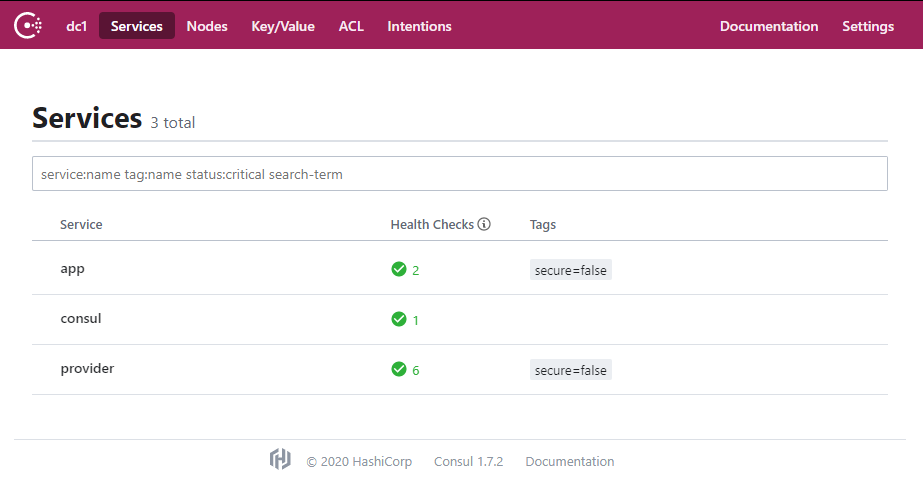
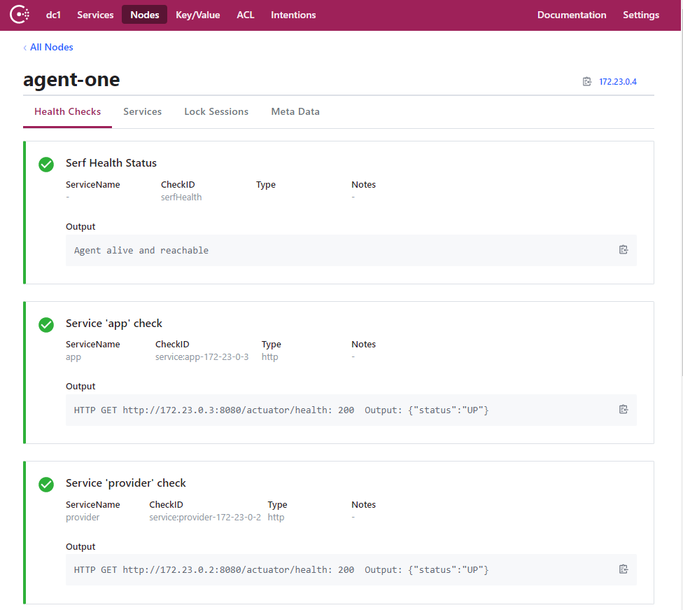
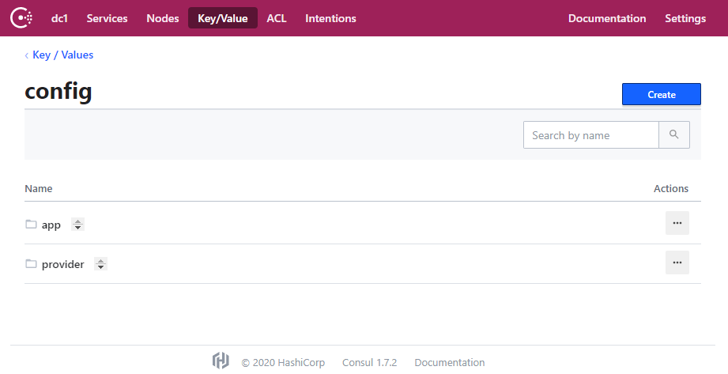
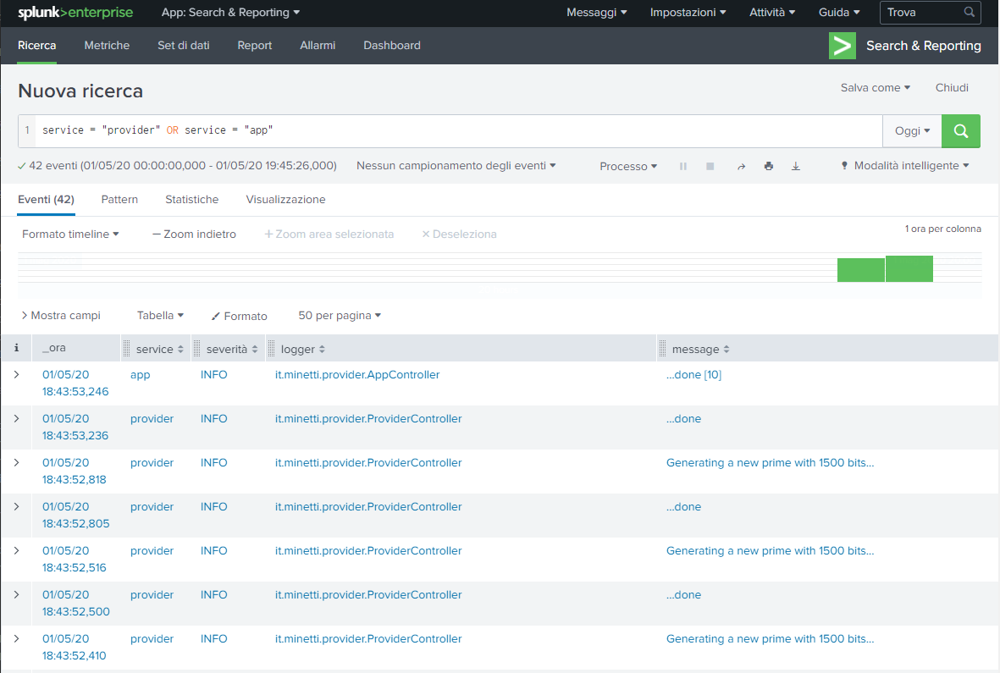
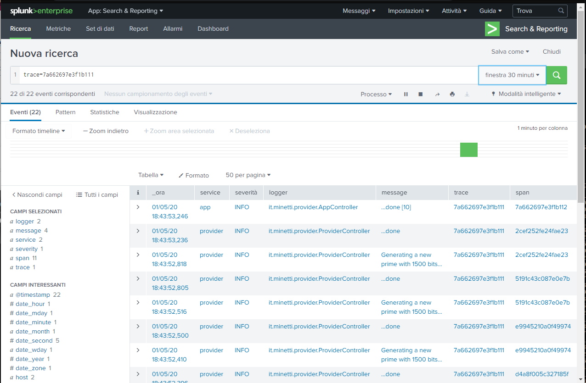

# Microservices with discovery

## Goal

The idea behind this project is to create a simple and working infrastructure to get the best from the Feign declarative REST client. This demo cover the following topics: 
* auto-discovery
* ribbon load balancer retry
* endpoint retry policy
* centralized configuration
* configuration automatic refresh
* tracing support 
* centralized logging.

## How to build and run

A running docker machine is mandatory for setup the whole environment, so if the docker machine is not running you can use the following command:

```sh
docker-machine start && docker-machine env
```

The following command builds and run the infrastructure, a prerequisite for the environment of microservices. The docker-compose-infra.yml includes:
* Consul engine that provides discovery, health check and shared configurations
* Splunk that collects logs and allows to search for them

```sh
docker-compose -f docker-compose-infra.yml up --build -d
```

There are two separate docker file, one for each microservice. Both services need to be compiled with maven to generate the executable jar in their corresponding target folder. Then the docker-compose is responsible to build and run the microservices with a proper scaling
 
```sh
mvn clean package -DskipTests && 
  docker-compose -f docker-compose-provider.yml up --build -d --scale provider=3  &&
  docker-compose -f docker-compose-app.yml up --build -d
```

For simplicity, you can build and run all together:

```sh
mvn clean package -DskipTests && 
  docker-compose -f docker-compose-infra.yml -f docker-compose-provider.yml -f docker-compose-app.yml up --build -d --scale provider=3
```

#### Running environment     

Use the following to check the active instances of microservices and infrastructure components. That specific format can be useful to retrieve the specific more important info.

```sh
docker ps --format "table {{.Names}}\t{{.Status}}\t{{.Ports}}"
```

The output expected is the following:

```
NAMES               STATUS                    PORTS
provider-log-fw_1   Up 22 minutes (healthy)   8088-8089/tcp, 9997/tcp
app-log-fw_1        Up 22 minutes (healthy)   8088-8089/tcp, 9997/tcp
provider_3          Up 22 minutes             0.0.0.0:8087->8080/tcp
splunk              Up 22 minutes (healthy)   8065/tcp, 8088-8089/tcp, 8191/tcp, 9887/tcp, 0.0.0.0:8000->8000/tcp, 9997/tcp
provider_2          Up 22 minutes             0.0.0.0:8086->8080/tcp
app                 Up 22 minutes             0.0.0.0:8080->8080/tcp
consul              Up 22 minutes             8300-8302/tcp, 8600/tcp, 8301-8302/udp, 0.0.0.0:8500->8500/tcp, 0.0.0.0:8600->8600/udp
provider_1          Up 22 minutes             0.0.0.0:8085->8080/tcp
```

To stop and destroy the whole infrastructure use the following command:

```sh
docker-compose -f docker-compose-infra.yml -f docker-compose-provider.yml -f docker-compose-app.yml down -v
```

## The infrastructure components

> :warning: **the docker machine ip may vary in your environment**, the following urls are tailored made on my own docker environment, my docker-machine is located at `192.168.99.100`. Change the ip to match your configuration, check it using `docker-machine ip`.

### Consul

This is the main page to retrieve details about the microservice, here you can check the services available and the running instances. 

* http://192.168.99.100:8500/ui/dc1/services



Thank to `spring-cloud-starter-consul-discovery` every instance of the services registers itself in Consul telling the url for the health check, then Consul queries it to monitor the availability of the instance; you can check the status here:

* http://192.168.99.100:8500/ui/dc1/nodes/agent-one



In order to get more details about the health check you can reach this url by REST API:

* http://192.168.99.100:8500/v1/agent/checks

It is possible to change dynamically the key/value properties used by the microservices. Currently each service uses one property from Consul. You can manually and programmatically add more properties via the REST API in Consul:

* http://192.168.99.100:8500/ui/dc1/kv/config/



### Splunk

The Splunk interface is available here, user is `admin` and password is `password` 

* http://192.168.99.100:8000

It allows to query the logs in a single place, it scrapes the distributed log directories for you thanks to the splunk universal forwarder. An example of a query is shown here:

* [Splunk simple query for app and provider](http://192.168.99.100:8000/it-IT/app/search/search?q=search%20service%20%3D%20%22provider%22%20OR%20service%20%3D%20%22app%22&display.page.search.mode=smart&dispatch.sample_ratio=1&workload_pool=&earliest=rt-30m&latest=rt&display.events.type=table&display.events.fields=%5B%22service%22%2C%22severity%22%2C%22logger%22%2C%22message%22%2C%22hostname%22%2C%22trace%22%5D&display.prefs.events.count=50&display.events.table.sortColumn=logger&sid=rt_1588504644.9&display.page.search.tab=events)



## The microservices

The project contains two spring-boot microservices, both are using almost the same dependencies defined in the parent `pom.xml` file. A specific `common` module provides the shared configuration for logging and for interaction with Consul. The dependencies in the parent `pom.xml` and the `common` module are intended as a draft framework that all the applications has to depend from to enable the basic features and to simplify the development.

### The `provider` application

The provider side contains a `@RestController` with two endpoints: one produces a prime number the second one does the same but may fail sometimes, the purpose of this behavior is to simulate outages. The bit size of the prime numbers can be configured using the properties in Consul. 

The provider application can scale up, in the previous `docker-compose ... --scale provider=3` command there are 3 providers. The accessible ports may vary between `8085` and `8095`. This are the two endpoints using the port `8087`, check with `docker ps` the actual port mapping:

* http://192.168.99.100:8087/prime
* http://192.168.99.100:8087/maybe-prime

### The main application: `app`

Under the module app there is the main application, it uses the feign client to interact with the provider. There are two endpoints that directly interact with the two endpoint of provider described just before:

* http://192.168.99.100:8080/just-one
* http://192.168.99.100:8080/just-one-lucky

The latter queries the provider, if the reply from the provider is http status `500` (pretending to be an outage) the application will use implicitly the ribbon balancer to retry the query using another provider instance in a round robin way. You can choose which statuses to retry using the following code, it is quite common to retry against network outages and `5xx` errors, for `4xx` errors the fault is due to the client.

```java
public class ProviderClientConfig {

    @Bean
    public ErrorDecoder errorDecoder() {
        return (methodKey, response) -> {
            FeignException exception = errorStatus(methodKey, response);
            if (HttpStatus.valueOf(response.status()).is5xxServerError()) {
                return new RetryableException(response.status(), response.reason(),
                        response.request().httpMethod(), exception, null, response.request());
            }
            return exception;
        };
    }
}
```

The interval is configured by an exponential backoff to prevent too many queries to a system in outage that can be too heavy loaded.

The third endpoint retrieves several data from the provider and aggregate them into a list; the list size can be dynamically configured size using the property in Consul

* http://192.168.99.100:8080/list

## Tracing

The microservices are tracing-enabled thanks to the `spring-cloud-starter-sleuth` dependency, compliant with `zipkin` standard. A very simple test you can do is using the following query:

```sh
curl -H 'X-B3-TraceId: 7a662697e3f1b112' -H 'X-B3-SpanId: 7a662697e3f1b112' '192.168.99.100:8080/list'
```

Then you can check in the logs for the specific trace id to follow what happened to this specific request in the whole end-to-end processing. We have the centralized logging, so you can use this query instead of `ssh` and `grep` on every the machine and instances.

* [Splunk query for trace = 7a662697e3f1b112](http://192.168.99.100:8000/it-IT/app/search/search?q=search%20trace%3D7a662697e3f1b112&display.page.search.mode=smart&dispatch.sample_ratio=1&workload_pool=&earliest=rt-30m&latest=rt&display.events.type=table&display.events.fields=%5B%22service%22%2C%22severity%22%2C%22logger%22%2C%22message%22%2C%22trace%22%2C%22span%22%5D&display.prefs.events.count=50&display.events.rowNumbers=0&display.events.table.wrap=1&display.events.list.wrap=1&display.events.maxLines=5&display.page.search.tab=events&sid=rt_1588358918.1224)



## Final notes

There are several points that are present just for a matter of sample, and are not intended to bring to an enterprise production environment. 

1. The retry mechanism is not always a good idea, because continuing to query an overloaded system may lead to decrease the performances of it. An exponential retry backoff can be useful, or you can follow the fail fast principle setting up a proper circuit breaker pattern using `hystrix` or the newest `resilience4j`.

2. In the main application there is just a single feign client, so does not matter if its own configuration are specific (using the `configuration` property of the `@FeignClient`) or global (annotating the configuration using `@Configuration`).

3. Splunk is a very powerful tool, no license is required if the daily log data is below 500MB, with more data an enterprise licence is required. There are free alternatives like `Kibana` and `graylog`.

4. I choose to use the splunk universal forwarder, but also the http connector, `fluentd` and `GELF` can be very good alternatives.

5. Despite the automatic refresh of properties from the configuration server is enabled by default, I strongly suggest to disable it using the property `spring.cloud.config.enable=false`. In a real situation is better to prepare all the properties, also related to more than one microservice, and then refresh the configuration in the specific microservices all at once. This is feasible thanks to the http `actuator/refresh` endpoint.

6. All the environment can run using docker, as I implemented, but the current configuration for the infrastructure is very far from an good production ready configuration.

_Enjoy, Alberto._
